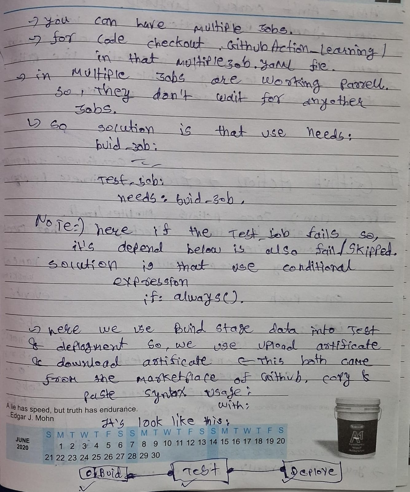

# GithubAction_Learning
A Learning Repository of GithubAction.

# GitHub Actions: 

## What is GitHub Actions?

GitHub Actions is a workflow automation platform integrated directly into GitHub repositories. It enables developers to automate software workflows including building, testing, and deploying applications without requiring external CI/CD systems.

---

# Github CICD


---

## Core Concepts

### Workflows

Workflows are automated procedures defined in YAML files stored in your repository. They:
- Represent an entire automated process
- Are composed of one or more jobs
- Are triggered by specific events in your GitHub repository
- Can be scheduled or manually triggered

# Github Action workFlow


### Events

Events are specific activities that trigger a workflow. Common events include:

- Repository events (push, pull request, fork)
- Schedule events (cron-based scheduling)
- Manual events (workflow dispatch, repository dispatch)
- Webhook events (external triggers)

### Jobs

Jobs are sets of steps executed on the same runner. Key characteristics:

- Jobs run in parallel by default
- Can be configured to run sequentially with dependencies
- Each job runs in a fresh instance of the virtual environment
- Jobs can be conditional based on specific criteria

# Job depend 
## Needs keyword

## Upload & Download Artificate


### Runners

Runners are the servers that execute your workflows:

- GitHub-hosted runners: Maintained by GitHub with various OS options
- Self-hosted runners: Your own machines configured to run GitHub Actions
- Each runner executes one job at a time

### Steps

Steps are individual tasks within a job:

- Can run commands or actions
- Share data and files within the same job
- Execute sequentially within their job
- Can be conditional based on previous steps

### Actions

Actions are reusable units of code:

- Pre-built automation that perform common tasks
- Can be created by GitHub, the community, or your organization
- Available in the GitHub Marketplace
- Help reduce repetitive code in workflows

## Environment and Context

### Environment Variables

Environment variables provide a way to:
- Store configuration information
- Pass data between workflow steps
- Reference repository information
- Access secrets safely

| **Workflow Level** | **Job Level** | **Step Level** |
|--------------------|---------------|----------------|
|  |  |  |

### Secrets

Secrets are encrypted environment variables that:
- Store sensitive information securely
- Are masked in logs
- Can be defined at repository or organization level
- Are accessible in workflow steps

### Contexts

Contexts are a way to access information about:
- Workflow runs
- Runner environments
- Jobs and steps
- GitHub events that triggered the workflow

## Common Workflow Patterns

### Continuous Integration

Automated testing and validation of code changes:
- Build and test on every push or pull request
- Enforce quality standards
- Notify developers of failures

### Continuous Deployment

Automated release processes:
- Deploy to staging or production environments
- Create release assets
- Publish packages to registries

### Matrix Builds

Testing across multiple configurations:
- Test on different operating systems
- Test against various versions of dependencies
- Run different test suites in parallel

### Conditional Execution

Running steps or jobs only when specific conditions are met:
- Based on branch name
- Based on file changes
- Based on specific tags or commit messages


## Best Practices

### Security

- Use secrets for sensitive information
- Limit permissions for workflow tokens
- Pin action versions to specific commits
- Audit third-party actions before use

### Performance

- Use caching to speed up builds
- Minimize unnecessary workflow runs
- Use matrix strategies for parallel testing
- Optimize job dependencies

### Maintenance

- Document workflows thoroughly
- Standardize workflow structures across repositories
- Create reusable workflows for common patterns
- Regularly update action versions

## Limitations and Considerations

- Workflow run time limits
- Storage and artifact size limits
- API rate limits
- Access control and permissions
- Self-hosted runner security

## Integration with GitHub Features

GitHub Actions integrates seamlessly with:
- Pull requests and code review
- Issues and project boards
- GitHub Packages
- GitHub Pages
- Code scanning and security features

By understanding these theoretical aspects of GitHub Actions, you can design effective automation strategies for your development workflows without getting lost in implementation details.


## Job Cocncurrancy

Means that in whcih at same time multiple workflow running so what is the concurrnacy so for that we do 
```bash
concurrency:
    group: Production-deployment
    cancel-in-progress: true
```
----
---

---

# Steps to craete github workflow

1. craete the folder .github/workflows

2. then create the anyName.yaml file inside the workflows.

--> You can get all the actions from the github marketplace


## Notes 📒


